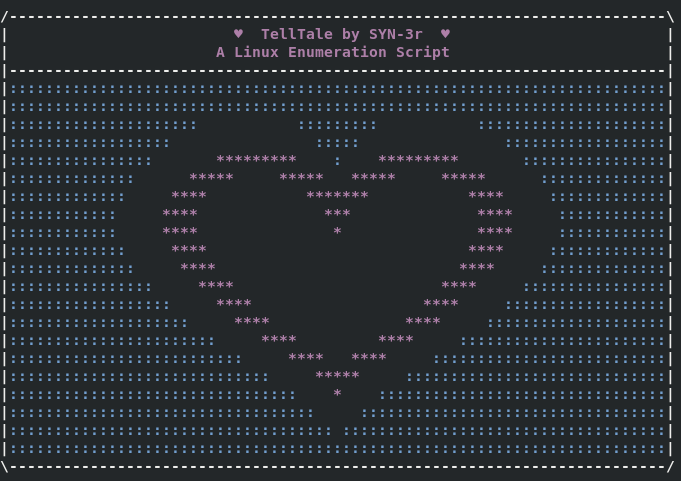
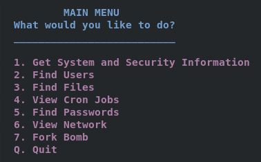
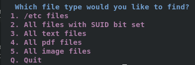

# TellTale
  
TellTale is a Linux enummeration script contructed with a menu system for an easy to use, visually aesthetic experience.  
  
  
The menu layout in this script allows users to easily navigate between different segments of the script without having to run everything at once.
Users may back out of the script at any point using the "Q" selection to quit.
  
  
Menus embedded within menus make the ennumeration process easy to execute.
  
  
Thank you for using my script!
 
 WARNING: TellTale and other scripts by SYN-3r should only be used for educational purposes or for authorized pentesters. The author is not responisible for any misuse.
